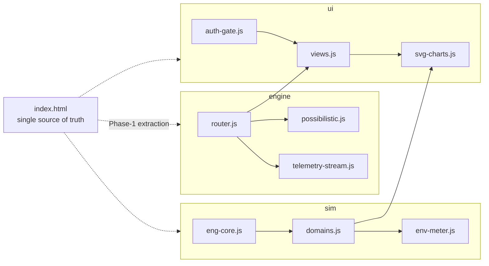
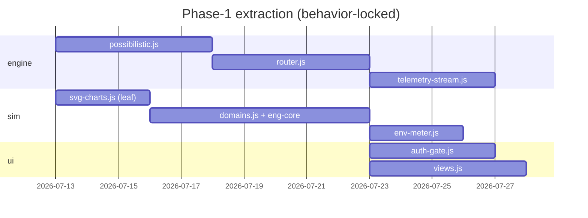

# UltraMassive.ML — Enterprise NOC Console (`ultramassive-noc-lite`)

**A zero-dependency, single-file, fully client-side prototype of the UltraMassive.ML
Enterprise Network Operations Console** — 13 live domain telemetry decks, a persistent
environmental-impact meter, and a simulated Autotelic Routing Engine, annotated
throughout with live-rendered KaTeX mathematics and bracket-numbered citations to real
literature.

> Status: **v0.1.0-alpha (prototype)** · License: **MIT** · Runtime deps: **none**[^1]

---

## 1. Mission

Give developers a tangible, breakable, *inspectable* artifact of what deterministic,
budget-paced LLM routing looks like at the operations layer — before they ever touch
the production SDK. Everything runs in a browser tab: open it, drag the sliders,
inject faults, read the math, check the references.

## 2. What this is / what this is not

**Is:** a faithful UX and information-architecture prototype. Every formula, metric
definition, and citation in the interpretation panels is real and independently
verifiable, and the interaction contracts (routing floor, tier escalation, drift
triggers [4], [5], error-budget burn [12]) behave qualitatively correctly.

**Is not:** a live system. All telemetry is a deterministic client-side
simulation[^2]. The routing decision is a keyword/length heuristic implementing the
*shape* of the production decision contract, not the trained router. Sign-in and
subscription tiers are client-side demo gates — real enforcement requires a backend
identity provider. The console discloses this in its own methodology modal; we
disclose it here too.

## 3. Quickstart (zero dependencies)

```bash
git clone https://github.com/ultramassive-ml/ultramassive-noc-lite
cd ultramassive-noc-lite

# Option A — just open it
open index.html            # xdg-open on Linux, start on Windows

# Option B — recommended: serve it, so session/consent cookies persist[^3]
python3 -m http.server 8080   # → http://localhost:8080
```

Sign in with any well-formed email + ≥8-character password (demo auth), pick a tier
(**Developer** is free and mounts a routing-only console), and you're in.

## 4. The routing model you are looking at

### 4.1 Deterministic tier selection

Every payload is mapped to the cheapest model tier — `Nano` ($0.0003/1k) →
`Standard` ($0.003/1k) → `Frontier` ($0.03/1k) — whose success confidence clears a
configurable floor **τ** (the *Min Confidence Floor* slider). Same input + same
constraints ⇒ same route, every time.

### 4.2 Possibilistic confidence, not probabilities

Confidence is carried as a *possibility–necessity band* in the sense of possibility
theory [1], [2]:

> Π(A) = supₓ∈A π(x)  and  N(A) = 1 − Π(Aᶜ)

Escalation to a higher tier triggers when **Π < τ** — the router acts on the band's
conservative edge rather than on a single optimistic point estimate.

**Figure 1 — Possibility–necessity bands per tier**


*Interpretation.* Each horizontal bar is one tier's confidence band `[N, Π]` for the
same example payload; the dashed red line is the floor τ = 0.85. Nano's entire band
sits below the floor (Π = 0.78 < τ), so it is inadmissible regardless of price.
Standard is the **cheapest admissible tier** (Π = 0.91 ≥ τ) and is selected, even
though Frontier's band is strictly better — paying for confidence you don't need is
exactly the waste the router exists to eliminate. Note the decision reads the *upper*
edge for admissibility but reports the *lower* edge N as the guaranteed margin, the
dual-measure discipline that distinguishes possibilistic from probabilistic gating
[1], [2].

### 4.3 The price of that decision, in dollars

**Figure 2 — FinOps tokenomics: blended cost vs. routing aggressiveness**


*Interpretation.* The x-axis sweeps routing aggressiveness *a* (the share of traffic
eligible for downshift); the tier mix follows the same closed form as the site's ROI
calculator. The grey dashed line is the monolithic frontier-only baseline
($0.030/1k); the cyan curve is the routed blended cost; the shaded band is the
realized **arbitrage spread**. At the default a = 0.60 the blend lands near
$0.0099/1k — a ~67% reduction — and the curve's convexity is the honest part:
the *first* downshifts are cheap wins, while pushing a → 1 yields diminishing
returns because a floor of frontier-mandatory traffic (compliance, high-complexity)
never downshifts. This is the number the NOC's SYS_PERF deck charts live [8], [9].

**Figure 3 — Tier price ladder and realized blended cost**


*Interpretation.* The log-scale ladder makes the two-orders-of-magnitude spread
between Nano and Frontier visible at a glance — the economic *potential energy* the
router harvests. The amber dashed line marks the blended cost of the default mix
(≈ 36% Nano / 35% Standard / 29% Frontier), and the annotation gives the realized
−67% against the frontier-only baseline. Read jointly with Figure 1: the blend is not
a quota, it is the *emergent* mix produced by per-request admissibility checks.

### 4.4 Drift is a first-class citizen

**Figure 4 — Semantic drift mitigation: detection and recovery**


*Interpretation.* The trace is the unbiased kernel two-sample statistic MMD²
between a sliding production window and the training baseline [4]. At tick 120 a
covariate shift is injected; the statistic breaches τ_drift = 0.30 within a few
ticks (shaded region) and the router engages autotelic fallback — pinning affected
slices to Frontier while the adaptation loop (detect → diagnose real-vs-virtual
drift → retrain or re-weight) runs, per the taxonomy of Gama et al. [5]. The decay
back under threshold is the recovery signature; a *sustained* plateau instead would
indicate real concept drift demanding retraining rather than routing changes. The
NOC's `DRIFT_TELEMETRY` deck renders exactly this dynamic with the same threshold
semantics.

## 5. The 13 decks

`ROUTING_NOC · DRIFT_TELEMETRY · SYS_PERF · ML_ENG · AI_ENG · MLOPS · DEVOPS ·
AI_CLOUD_ENG · SCI_ACADEMIC_RSCH · DATA_SCIENCE · CYBER_DEFENSE ·
BIG_DATA_PIPELINES · QUANTUM_OPS`

Each deck carries 3–5 live scan-line SVG charts, interactive fault-injection and
tuning controls, a rigorous KaTeX interpretation, and bracket-numbered IEEE citations
rendered in-panel (49 references across the console, from kernel two-sample tests [4]
to surface-code error suppression and NIST zero-trust architecture). The persistent
**ENV_IMPACT** meter tracks kW draw, PUE [10], grid carbon intensity, and
routing-avoided emissions [11], [12], with a cited methodology modal.

## 6. Repository architecture

**Figure 5 — Module dependency graph (Phase-1 target)**



*Interpretation.* Solid arrows are the target import graph; dotted arrows are the
extraction moves. Three invariants are encoded here: `svg-charts.js` is a pure leaf
(charts never own state), `auth-gate.js` is the **only** module that can mount the
console (single choke point), and `engine/*` has no UI imports — which is precisely
what lets the same engine contract later be satisfied by the live SDK (§8). Today
`index.html` is the single source of truth; `src/` holds honest stubs, each pointing
at the exact line ranges it will absorb.

**Figure 6 — Extraction roadmap**



*Interpretation.* Leaves first (`svg-charts`, `possibilistic`), state-owners second,
chrome last — every extraction is behavior-locked against a fixed tick sequence
before merge (see [`docs/ARCHITECTURE.md`](docs/ARCHITECTURE.md), which maps every
function to its verified line anchor in the monolith).

```
ultramassive-noc-lite/
├── index.html                     ← the working prototype (single source of truth)
├── README.md · LICENSE · CONTRIBUTING.md
├── build/                         ← real Tailwind CLI build that produced the shipped CSS
│   ├── build.sh · tailwind.config.js · input.css
├── docs/
│   ├── ARCHITECTURE.md            ← line-verified extraction map
│   ├── assets/                    ← Figures 1–4 + SDK figures (generated, versioned)
│   └── sdk/autotelic-router-sdk.md
├── src/                           ← Phase-1 extraction targets (honest stubs)
│   ├── engine/  router.js · possibilistic.js · telemetry-stream.js
│   ├── sim/     eng-core.js · domains.js · env-meter.js
│   ├── ui/      views.js · svg-charts.js · auth-gate.js
│   └── styles/  README.md
└── .github/
    ├── ISSUE_TEMPLATE/  bug_report · feature_request · telemetry_feedback
    └── PULL_REQUEST_TEMPLATE.md
```

## 7. Rebuilding the stylesheet

Styling is **compiled** Tailwind (CLI v3.4.17) inlined in `index.html` — the Play CDN
is intentionally absent[^4]. If you add or remove utility classes:

```bash
./build/build.sh    # scans index.html, emits build/compiled.css
```

then paste the output into the `<style>` block marked `compiled with Tailwind CLI`.

## 8. Feedback, issues, and feature requests

Use the structured forms in `.github/ISSUE_TEMPLATE/`. Pasting elsewhere? Use:

```markdown
### Type
Bug | Feature request | Telemetry-accuracy feedback | Docs

### Deck / surface
(e.g., QUANTUM_OPS, ENV_IMPACT strip, sign-in gate)

### What happened / what you want
1–3 sentences. Bugs: exact steps, expected vs. actual.

### Environment
Browser+version · OS · served (http.server) or file://

### Math/citation feedback (if applicable)
Panel, the claim at issue, and a source (paper/section/equation).

### Console output
Paste verbatim.
```

**Telemetry-accuracy feedback is explicitly invited** — if a simulated dynamic
misrepresents its cited literature (wrong functional form, wrong constant, missing
regime), file it. We treat citation and functional-form accuracy as a ship-blocking
bug class.

## 9. Roadmap

- [ ] Phase-1 extraction per Figure 6 and `docs/ARCHITECTURE.md`
- [ ] Vendored KaTeX + fonts for a fully offline single file
- [ ] OIDC-shaped auth flow so a real identity provider is a drop-in
- [ ] Live-mode adapter: point `engine/router` at the
      [Autotelic Router SDK](docs/sdk/autotelic-router-sdk.md)

## References

[1] L. A. Zadeh, "Fuzzy sets as a basis for a theory of possibility," *Fuzzy Sets and
Systems*, vol. 1, no. 1, pp. 3–28, 1978.
[2] D. Dubois and H. Prade, *Possibility Theory: An Approach to Computerized
Processing of Uncertainty*. New York: Plenum Press, 1988.
[3] A. Shamir, "How to share a secret," *Communications of the ACM*, vol. 22, no. 11,
pp. 612–613, 1979.
[4] A. Gretton, K. M. Borgwardt, M. J. Rasch, B. Schölkopf, and A. Smola, "A kernel
two-sample test," *Journal of Machine Learning Research*, vol. 13, pp. 723–773, 2012.
[5] J. Gama, I. Žliobaitė, A. Bifet, M. Pechenizkiy, and A. Bouchachia, "A survey on
concept drift adaptation," *ACM Computing Surveys*, vol. 46, no. 4, 2014.
[6] Y. Feng, H. You, Z. Zhang, R. Ji, and Y. Gao, "Hypergraph neural networks," in
*Proc. AAAI*, 2019, arXiv:1809.09401.
[7] D. Zhou, J. Huang, and B. Schölkopf, "Learning with hypergraphs: Clustering,
classification, and embedding," in *Proc. NeurIPS*, 2006.
[8] J. D. C. Little, "A proof for the queuing formula L = λW," *Operations Research*,
vol. 9, no. 3, pp. 383–387, 1961.
[9] W. Kwon et al., "Efficient memory management for large language model serving
with PagedAttention," in *Proc. ACM SOSP*, 2023, arXiv:2309.06180.
[10] C. Belady, A. Rawson, J. Pfleuger, and T. Cader, "Green Grid data center power
efficiency metrics: PUE and DCiE," The Green Grid, White Paper #6, 2008.
[11] E. Masanet, A. Shehabi, N. Lei, S. Smith, and J. Koomey, "Recalibrating global
data center energy-use estimates," *Science*, vol. 367, no. 6481, pp. 984–986, 2020.
[12] D. Patterson et al., "Carbon emissions and large neural network training,"
arXiv:2104.10350, 2021.

## Footnotes

[^1]: "Zero dependency" refers to the run path: no build step, package manager, or
server is required to execute the prototype. KaTeX and Google Fonts load from public
CDNs; a fully vendored offline build is on the roadmap (§9).
[^2]: Deterministic given the tick sequence and control state; stochastic jitter uses
unseeded `Math.random()` for visual liveliness only — no decision path depends on it.
[^3]: Some browsers scope or block cookies on `file://` origins, which affects the
demo session and cookie-consent persistence; `http.server` gives faithful behavior.
[^4]: The Play CDN is a runtime JIT compiler and emits a console warning in
production. The compiled stylesheet was generated with the config in `build/` against
this exact file; classes not present in the file are purged, so rebuild after edits.

---
MIT © 2026 UltraMassive Advanced Scientific Research Corp. — *Imagination Beyond
Boundaries, Impact Beyond Measure.*
