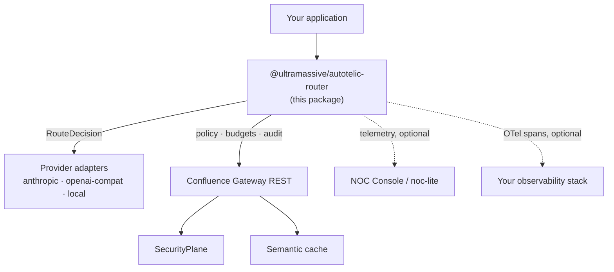
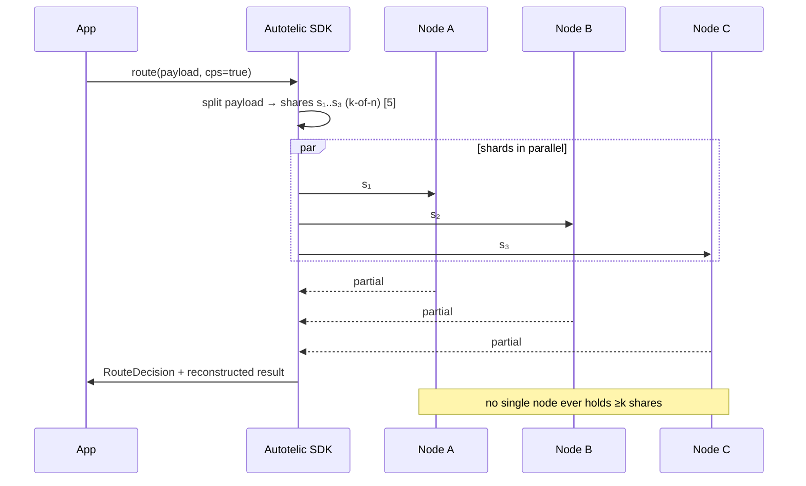

# Autotelic Router SDK Package

> **Space:** Confluence Developer Suite / SDK Packages
> **Status:** `DRAFT — interface specification v0.1.0-alpha` · **Owner:** DevRel / Routing Platform
> **Audience:** application developers integrating tier-routing independently of the NOC Console
> **Contract vs. implementation:**[^1] this page specifies the SDK *contract*. The public
> `noc-lite` prototype implements the contract's shape with a synthetic heuristic; the
> trained production router ships behind this same interface.

---

## 1. Overview & value proposition

The **Autotelic Routing Engine** is the routing agent of the **Confluence** platform: a
relational, possibility-calibrated LLM router grounded in possibility theory [1], [2].
For every request it assembles a small hypergraph of task features [3], [4] and routes
to the **cheapest model tier whose possibility of success clears a configurable
confidence floor** — turning model selection into an explainable, budget-paced,
deterministic decision instead of a hard-coded pick.

**The three-line pitch.**
1. **Deterministic & explainable** — same payload + constraints ⇒ same route, with a
   machine-readable rationale and a possibility–necessity band on every decision [1], [2].
2. **Budget-paced by construction** — FinOps tokenomics live inside the objective;
   tier arbitrage is measured per request, not reconstructed in a dashboard.
3. **Drops in beneath your calls** — one client wraps your provider SDKs; the NOC
   Console is an optional observability head, never a dependency.

## 2. Position in the Confluence ecosystem

**Figure 1 — Ecosystem placement**



*Interpretation.* The SDK sits between your application and provider adapters; the
Gateway path (policy, budgets, audit) and both observability heads are optional —
nothing in the request hot path depends on them. This is the diagram to check when a
security review asks "what does the router phone home to": by default, nothing.
Sibling packages: `confluence-gateway-client`, `confluence-securityplane`,
`confluence-eval`.

## 3. Core mechanisms

### 3.1 Relational hypergraph featurization

**Figure 2 — One request as a hypergraph**


*Interpretation.* Vertices are task features extracted from the payload and
constraints; hyperedges capture their *joint* interactions — here `e₁` binds
`{phi_redact, domain:clinical, output:json}` into a single compliance contract,
`e₂` binds the compute envelope, `e₃` the corpus prior. The point of hyperedges over
pairwise edges is that admissibility is often a property of a feature *set*, not any
pair: PHI redaction in a clinical domain with a strict output contract is
frontier-mandatory even though each feature alone is not [3], [4]. Beliefs are
relations between model × capability — scoring consumes this structure, not a
flattened feature vector.

### 3.2 Possibilistic confidence calibration

Every tier receives a possibility–necessity band `(Π, N)` with `N(A) = 1 − Π(Aᶜ)`
[1], [2]. Routing escalates when `Π < τ`; the decision object reports both measures
so callers can gate side-effects on the conservative `N` while admissibility uses `Π`.

### 3.3 Deterministic tier selection

**Figure 3 — The decision surface**


*Interpretation.* The plane is (task complexity *c*, floor τ); each colored region is
the tier returned by `argmin cost s.t. Π_tier(c) ≥ τ`. Three properties to verify by
eye: boundaries are **monotone** (raising τ at fixed *c* can only escalate — no
non-monotonic surprises for auditors); regions are **contiguous** (no islands: nearby
payloads route alike, which is what makes decisions explainable to operators); and the
top-right **REJECT/HUMAN** region is load-bearing — when even Frontier's possibility
cannot clear an aggressive floor, the honest answer is refusal-with-rationale, not
silent best-effort. The surface is fixed given a router version: replaying a decision
trace reproduces it exactly.[^2]

**Figure 4 — What the floor costs you: escalation curves**


*Interpretation.* For three payload classes (the NOC's presets), the curves give the
probability that the cheapest tier is inadmissible as a function of τ, modeled as
Φ((τ−μ_Π)/σ) over the class's possibility spread. The operational reading: τ is a
**price dial with class-dependent elasticity** — moving 0.85 → 0.95 barely touches
ETL extraction (green) but pushes PHI redaction (red) to near-certain frontier
escalation. Set τ per route-class, not globally; the SDK's `Constraints` accepts a
per-call override for exactly this reason.

### 3.4 Cryptographic prompt sharding (CPS)

**Figure 5 — CPS request path**



*Interpretation.* Optional per-request payload disaggregation via k-of-n secret
sharing in the Shamir construction [5]: any k shares reconstruct, any k−1 reveal
nothing information-theoretically. The property to communicate to security review is
the **note at the bottom** — the threat model is a compromised *single* external
node, and the mitigation is structural, not policy. CPS costs one parallel fan-out of
latency and is surfaced in the decision trace, so its use is auditable per
request.[^3]

### 3.5 Semantic drift mitigation (SDM)

Kernel two-sample statistics (MMD) against training baselines run alongside routing
[6]; sustained excursions past τ_drift trigger autotelic fallback before quality
visibly degrades, following the detect→diagnose→adapt loop of the drift-adaptation
literature [7]. Modes: `LENIENT | BALANCED | STRICT`. (See README Figure 4 for the
trigger timeline rendered from the same semantics.)

### 3.6 FinOps tokenomics

**Figure 6 — The economic potential the router harvests**


*Interpretation.* The tier ladder spans two orders of magnitude on the log scale;
the amber line is the blended cost realized by the default admissibility mix and the
annotation is the spread against a frontier-only baseline (−67%). Two honest
readings: the blend is *emergent* from per-request Π ≥ τ checks, never a quota — so
your realized spread depends on your traffic's complexity distribution, not on this
chart; and the reported per-request `baseline_cost − cost_estimate` is the number to
aggregate, since it composes correctly across heterogeneous workloads [8], [9].

## 4. Package structure

```
autotelic-router/                      # pip: umml-autotelic-router · npm: @ultramassive/autotelic-router[^4]
├── router.(py|ts)        AutotelicRouter — construct, route(), execute(), stream()
├── possibilistic.(py|ts) Band math: pi_necessity(), clears_floor()
├── featurize.(py|ts)     payload → hypergraph (V, E, incidence)
├── tiers.(py|ts)         Tier registry + pricing table (Nano/Standard/Frontier)
├── cps.(py|ts)           Prompt sharding adapter (optional extra)  [5]
├── sdm.(py|ts)           Drift monitors + fallback policy          [6], [7]
├── telemetry.(py|ts)     Decision trace, arbitrage meter, NOC/OTel exporters
└── adapters/             anthropic.(py|ts) · openai-compat.(py|ts) · local.(py|ts)
```

## 5. Initialize & route — independent of the NOC Console

**Python**
```python
from autotelic_router import AutotelicRouter, Constraints

router = AutotelicRouter(
    floor=0.85,                      # τ — min possibility to accept a tier
    sdm="strict",                    # lenient | balanced | strict
    cps=True,                        # cryptographic prompt sharding [5]
    budget_per_day_usd=250.0,        # soft pacing target
    adapters={"frontier": "anthropic:claude-sonnet-4-6"},
)

decision = router.route(
    payload="Redact all PHI from the attached transcript per HIPAA Safe Harbor…",
    constraints=Constraints(max_latency_ms=1200, output="json", floor=0.92),  # per-call τ override
)

decision.tier           # "frontier"
decision.possibility    # 0.98      (admissibility edge, Π)
decision.necessity      # 0.96      (guaranteed margin, N)
decision.rationale      # human-readable + machine-parsable trace
decision.cost_estimate  # USD; decision.baseline_cost gives the spread

result = router.execute(decision)   # runs via the bound adapter
```

**TypeScript**
```ts
import { AutotelicRouter } from "@ultramassive/autotelic-router";

const router = new AutotelicRouter({ floor: 0.85, sdm: "balanced", cps: false });

const d = await router.route({ payload, constraints: { output: "json" } });
if (d.necessity < 0.8) console.warn("thin margin:", d.rationale);

router.on("fallback", (e) => metrics.incr("autotelic.fallback", { from: e.from, to: e.to }));
router.on("drift",    (e) => alerting.page(`MMD²=${e.mmd2} > τ_drift on ${e.slice}`));

const out = await router.execute(d);
```

**Decision contract (both languages).**
`RouteDecision { tier, possibility, necessity, floor, qsfp_risk, rationale, features,
cost_estimate, baseline_cost, trace_id }` — stable across SDK versions; the NOC
prototype's `RAW_DUMP` modal shows this exact shape.

## 6. Observability & the optional NOC head

`router.telemetry.attach_noc(url)` streams decisions to a NOC Console instance;
`attach_otel(exporter)` emits spans (`route`, `band_eval`, `execute`). Nothing in the
hot path depends on either (Figure 1).

## 7. Page outline (child pages to author)

1. Quickstart — install matrices, auth, first route (§5 expanded)
2. Concepts: possibility vs. probability — why bands [1], [2], worked examples
3. Hypergraph featurization reference — taxonomy, custom features API [3], [4]
4. Tier registry & pricing — bring-your-own tiers, adapter authoring
5. CPS deep dive — threat model, sharding scheme [5], ops runbook
6. SDM & fallback policy — MMD windows [6], thresholds, replay tooling [7]
7. FinOps guide — budgets, pacing, arbitrage reporting [8], [9]
8. Decision-trace schema — `RouteDecision` field-by-field, versioning policy
9. NOC integration — pointing `noc-lite` at a live router
10. Changelog & compatibility matrix

## References

[1] L. A. Zadeh, "Fuzzy sets as a basis for a theory of possibility," *Fuzzy Sets and
Systems*, vol. 1, no. 1, pp. 3–28, 1978.
[2] D. Dubois and H. Prade, *Possibility Theory: An Approach to Computerized
Processing of Uncertainty*. New York: Plenum Press, 1988.
[3] Y. Feng, H. You, Z. Zhang, R. Ji, and Y. Gao, "Hypergraph neural networks," in
*Proc. AAAI*, 2019, arXiv:1809.09401.
[4] D. Zhou, J. Huang, and B. Schölkopf, "Learning with hypergraphs: Clustering,
classification, and embedding," in *Proc. NeurIPS*, 2006.
[5] A. Shamir, "How to share a secret," *Communications of the ACM*, vol. 22, no. 11,
pp. 612–613, 1979.
[6] A. Gretton, K. M. Borgwardt, M. J. Rasch, B. Schölkopf, and A. Smola, "A kernel
two-sample test," *Journal of Machine Learning Research*, vol. 13, pp. 723–773, 2012.
[7] J. Gama, I. Žliobaitė, A. Bifet, M. Pechenizkiy, and A. Bouchachia, "A survey on
concept drift adaptation," *ACM Computing Surveys*, vol. 46, no. 4, 2014.
[8] J. D. C. Little, "A proof for the queuing formula L = λW," *Operations Research*,
vol. 9, no. 3, pp. 383–387, 1961.
[9] W. Kwon et al., "Efficient memory management for large language model serving
with PagedAttention," in *Proc. ACM SOSP*, 2023, arXiv:2309.06180.

## Footnotes

[^1]: Concretely: §3's mechanisms and §5's API are normative for the production
package; the `noc-lite` heuristic honors the *decision shape* (fields, monotonicity,
determinism) but not the trained scoring function. Discrepancies between this page
and shipped behavior are documentation bugs — file them.
[^2]: Determinism is scoped to (router version, tier registry version, config). The
`trace_id` embeds all three so replays are pinned; upgrading the router may legally
move boundaries, which is why traces version rather than merely log.
[^3]: Expected overhead is one parallel fan-out (max of shard round-trips) plus
reconstruction; measure with `telemetry.attach_otel` before enabling fleet-wide.
CPS protects payload confidentiality against single-node compromise; it is not a
substitute for transport security or provider-side controls.
[^4]: Package names are reserved; publication follows the v0.1 interface freeze.
Import paths above are final.

---
*MIT-licensed prototype: [`ultramassive-noc-lite`](../../README.md).*
